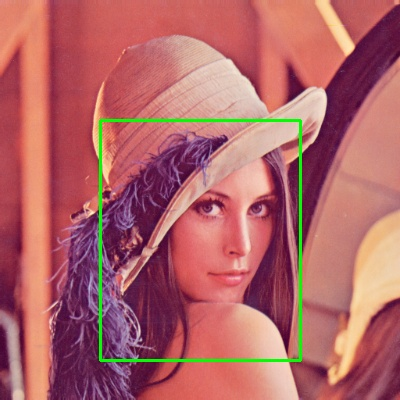
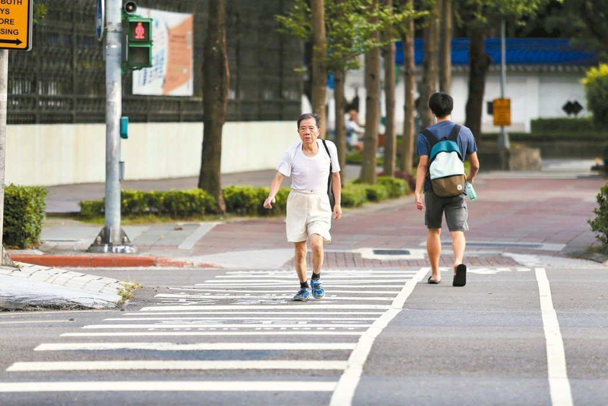
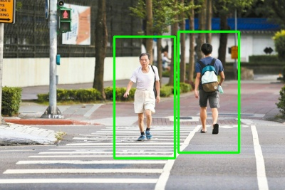

# 🚶‍♂️ LAB11 Pedestrian Detection with Raspberry Pi and OpenCV

This project is the LAB11 assignment for the Embedded Systems course. The main goal is to implement basic image processing and pedestrian detection on a Raspberry Pi using Python and OpenCV.

The project includes basic image operations such as image reading, resizing, region of interest extraction, rectangle drawing, grayscale conversion, and CLAHE contrast enhancement. In addition, this project implements pedestrian detection using the HOG algorithm with OpenCV's built-in SVM people detector.

---

## 📌 Project Overview

This LAB focuses on computer vision and embedded system implementation.

The program reads an input image, resizes it to a width of 400 pixels while maintaining the original aspect ratio, detects pedestrians, and draws green bounding boxes around detected targets.

Because the project was executed through SSH, the program saves output images and videos instead of using `cv2.imshow()`.

---

## 🧰 Hardware and Software Requirements

### Hardware

- Raspberry Pi
- SD card
- Computer or laptop
- Wi-Fi network
- Optional USB webcam

### Software

- Raspberry Pi OS
- Python 3
- OpenCV
- NumPy
- imutils
- VS Code Remote SSH or PowerShell SSH

---

## 📁 Project Structure

```text
lab11/
├── README.md
├── sample.py
├── processing.py
├── video_processing.py
├── test_opencv.py
├── webcam.py
├── 998_763_14_35.xml
├── img/
│   ├── input.jpg
│   ├── pedestrian.jpg
│   ├── Lenna.png
│   ├── original.jpg
│   ├── resized.jpg
│   ├── roi.jpg
│   ├── rectangle.jpg
│   ├── gray.jpg
│   ├── clahe.jpg
│   └── sample_result.jpg
└── video/
    ├── video.mp4
    └── video_result.mp4
```

---

## 🚀 Installation

### 1. Connect to Raspberry Pi through SSH

```bash
ssh wayne@10.153.130.16
```

If the IP address changes, check the Raspberry Pi IP address first.

```bash
hostname -I
```

---

### 2. Enter the project folder

```bash
cd ~/lab11
```

---

### 3. Create and activate Python virtual environment

```bash
python3 -m venv env
source env/bin/activate
```

---

### 4. Install required packages

```bash
pip install --upgrade pip
pip install opencv-python imutils numpy
```

---

## 🧪 Basic Image Processing

Run the image processing program:

```bash
python3 processing.py
```

This program performs the following operations:

- Read image
- Resize image
- Extract ROI
- Draw rectangle
- Convert image to grayscale
- Apply CLAHE enhancement
- Save output images

---

## 🖼️ Image Processing Results

### Original Image


### Resized Image


### ROI Result


### Rectangle Drawing Result



### Grayscale Result


### CLAHE Result


---

## 🚶‍♂️ Pedestrian Detection

Run the pedestrian detection program:

```bash
python3 sample.py
```

The program performs the following steps:

1. Read the pedestrian image.
2. Resize the image width to 400 pixels while keeping the original aspect ratio.
3. Use HOGDescriptor with OpenCV's default SVM people detector.
4. Apply non-maximum suppression to reduce duplicated bounding boxes.
5. Draw green bounding boxes around detected pedestrians.
6. Save the result as `sample_result.jpg`.

---

## ✅ Pedestrian Detection Demo

### Input Image



### Detection Result



---

## 🎞️ Video Detection Demo

Run the video processing program:

```bash
python3 video_processing.py
```

The program reads a video, processes each frame, detects pedestrians, draws bounding boxes, and outputs the result video.

### Demo Video

https://github.com/user-attachments/assets/7b5c1af6-3fb6-4137-ade0-3e4238555d87

---

## 🧠 HOG Algorithm Explanation

HOG stands for Histogram of Oriented Gradients.

The main idea of HOG is to describe an object by using edge and gradient direction information. It calculates the direction and strength of brightness changes in local image regions, then converts these gradient directions into histograms.

For pedestrian detection, the human body has recognizable contour features, such as the head, shoulders, torso, and legs. HOG extracts these shape features and converts them into feature vectors. Then, an SVM classifier determines whether a region contains a pedestrian.

In this project, OpenCV's built-in HOGDescriptor and default people detector are used to perform pedestrian detection.

---

## 🧾 Demo Commands

During the demo, run the following commands:

```bash
cd ~/lab11
source env/bin/activate
python3 sample.py
ls
```

If `sample_result.jpg` is generated successfully, the pedestrian detection demo is complete.

For video detection:

```bash
python3 video_processing.py
ls
```

If `video_result.mp4` is generated successfully, the video detection demo is complete.

---

## 📚 Experiment Summary

Through this experiment, I learned how to use Raspberry Pi with OpenCV for image processing and pedestrian detection.

I also learned how to solve display issues in an SSH environment by replacing `cv2.imshow()` with `cv2.imwrite()` and `VideoWriter`.

This project helped me understand the basic workflow of computer vision, including image preprocessing, feature extraction, object detection, and result visualization.

